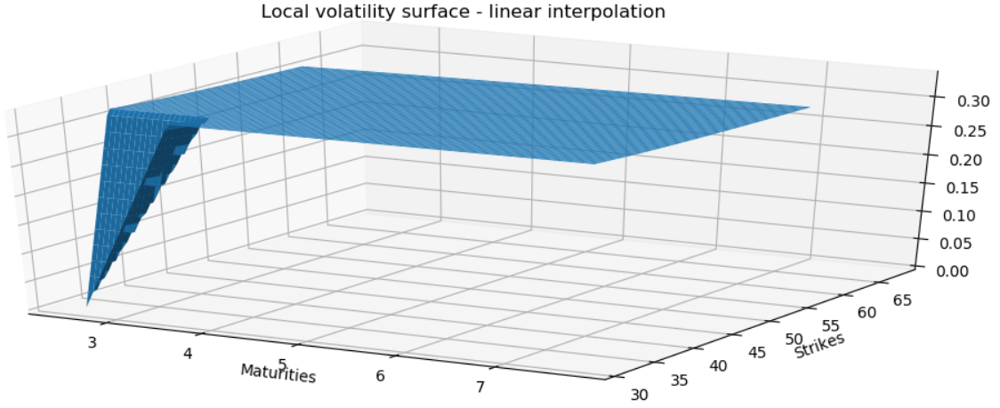
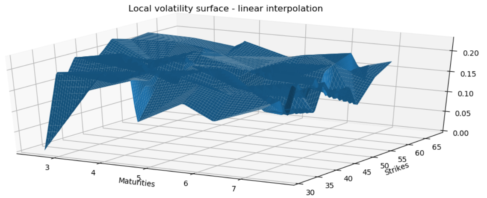
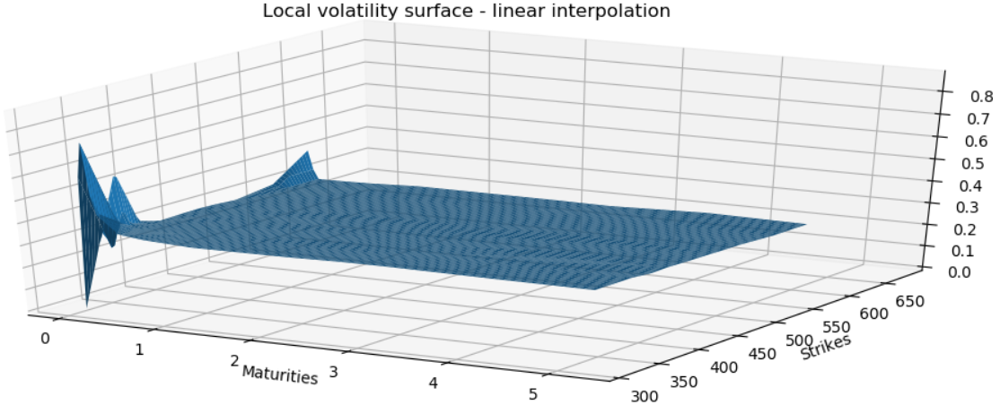
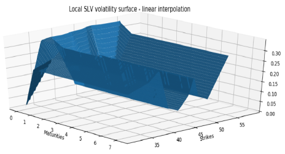
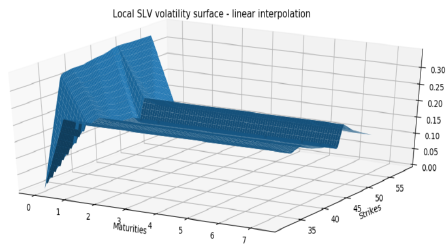

# Stochastic Local Volatility Models
- Stochastic local volatility model calibration
- McKean-Vlasov type equity dynamic
- Particle method type calibration algorithm

# Results
## Local volatility surface with flat equity smile

## Local volatility surface with non flat equity smile

## Local volatility surface with low interest rate volatility 

## SLV local volatility surface - 100 particle

## SLV local volatility surface - 1000 particle

